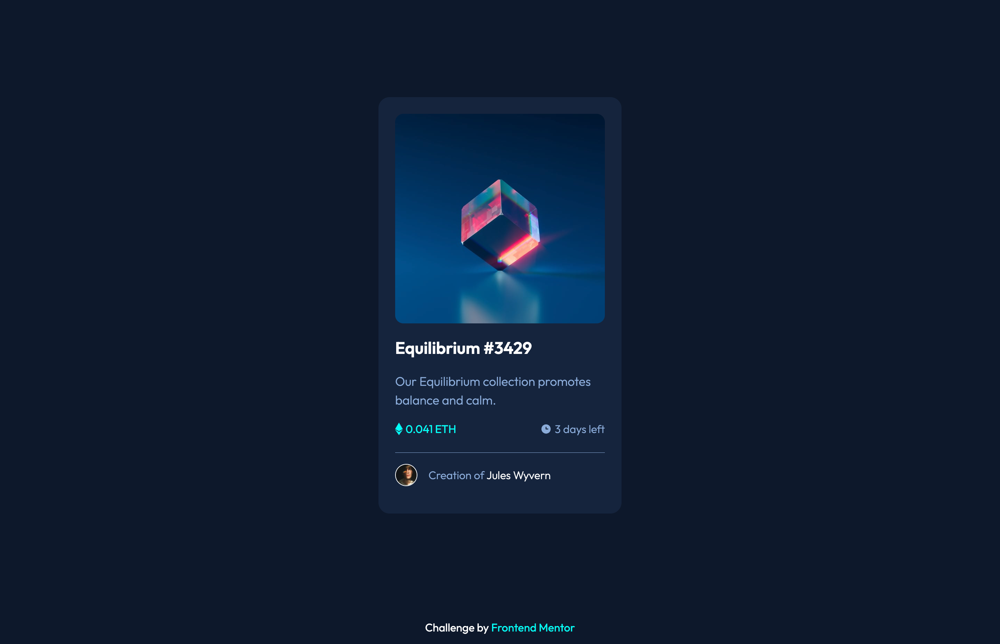
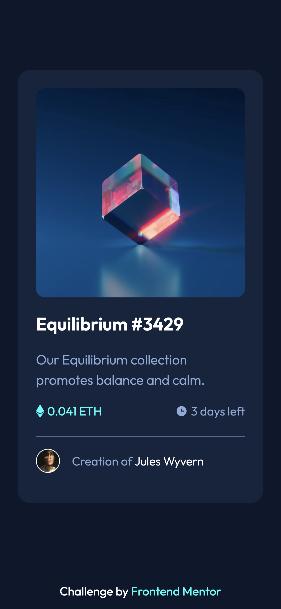

# NFT Preview Card Component

Solution for the [Frontend Mentor](https://frontendmentor.io) challenge - [NFT Preview Card Component](https://www.frontendmentor.io/challenges/nft-preview-card-component-SbdUL_w0U)

## Table of contents

- [The challenge](#the-challenge)
- [Screenshots](#screenshots)
- [Links](#links)
- [Built with](#built-with)

## The challenge

- View the optimal layout depending on their device's screen size
- See hover states for interactive elements

## Screenshots

## Links

- [Live Site](https://su-fm-newbie.netlify.app/nft-preview-card-component/)
- [Solution](https://www.frontendmentor.io/solutions/qr-code-component-mzZAz5ixZE)

## Built with

- CSS custom properties (variables)
- Flexbox
