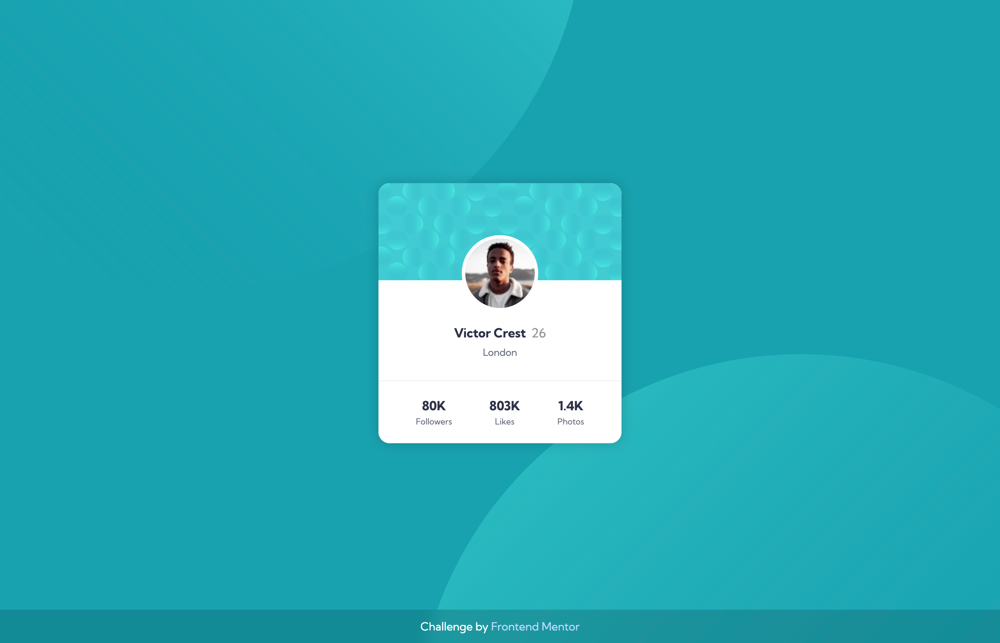
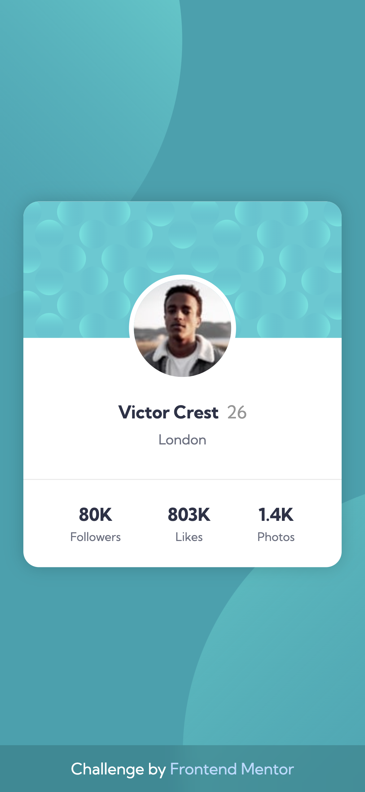

# Profile Card Component

Solution for the [Frontend Mentor](https://frontendmentor.io) challenge - [Profile Card Component](https://www.frontendmentor.io/challenges/profile-card-component-cfArpWshJ)

## Table of contents

- [The challenge](#the-challenge)
- [Screenshots](#screenshots)
- [Links](#links)
- [Built with](#built-with)

## The challenge

- Build out the project to the designs provided

## Screenshots

## Links

- [Live Site](https://su-fm-newbie.netlify.app/profile-card-component/)
- [Solution](https://www.frontendmentor.io/solutions/profile-card-component-iPvuSspLDl)

## Built with

- CSS custom properties (variables)
- Flexbox
