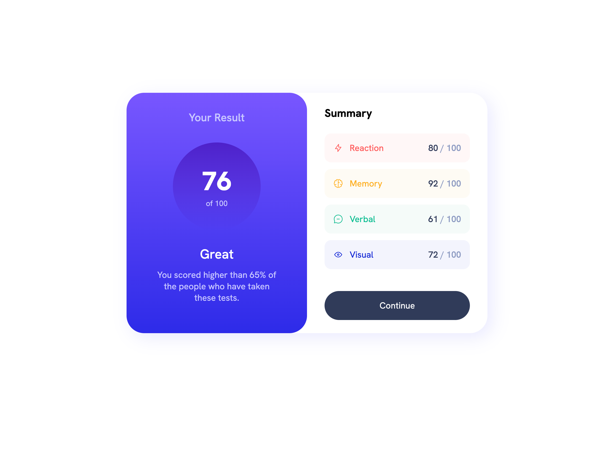
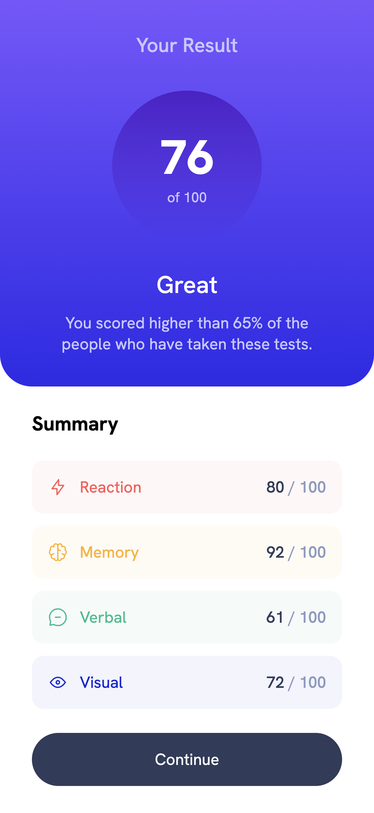

# Results Summary Component

Solution for the [Frontend Mentor](https://frontendmentor.io) challenge - [Results Summary Component](https://www.frontendmentor.io/challenges/results-summary-component-CE_K6s0maV)

## Table of contents

- [The challenge](#the-challenge)
- [Screenshots](#screenshot)
- [Links](#links)
- [Built with](#built-with)

## The challenge

Users should be able to:

- View the optimal layout for the interface depending on their device's screen size
- See hover and focus states for all interactive elements on the page

## Screenshots

## Links

## Built with

- CSS custom properties (variables)
- Flexbox
- Mobile-first approach
