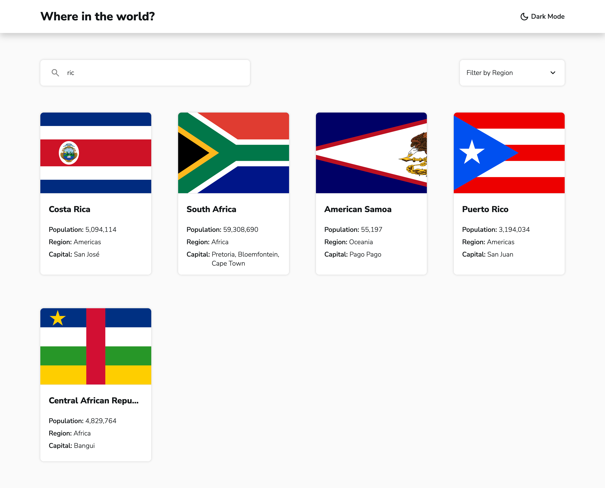
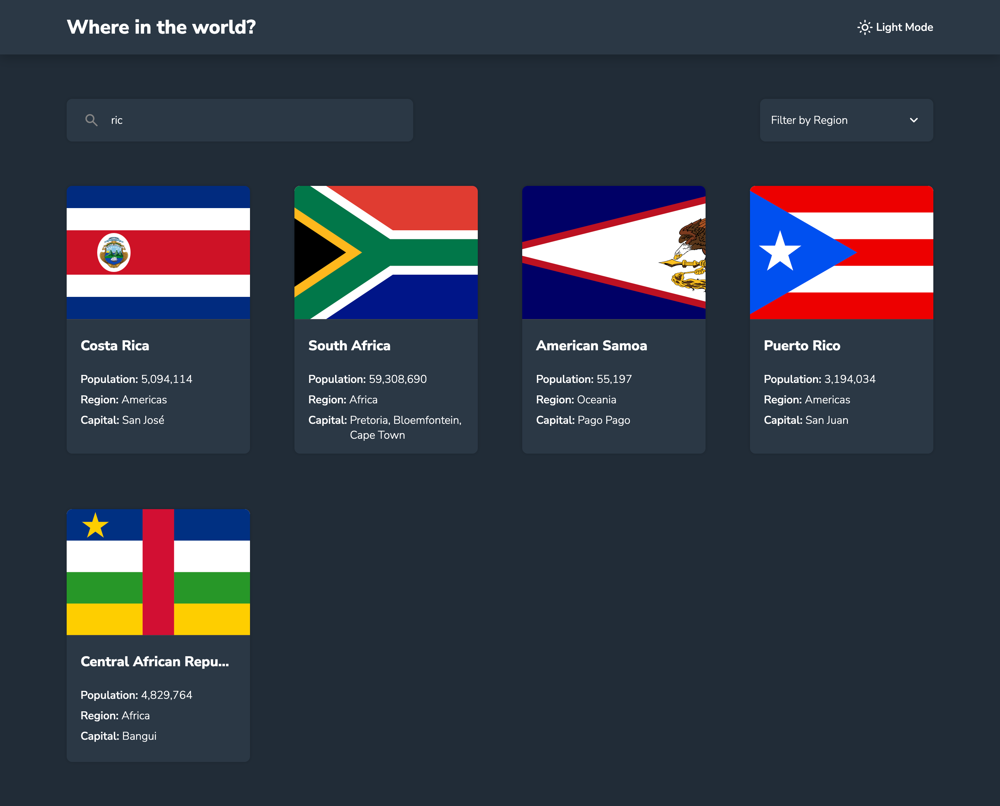
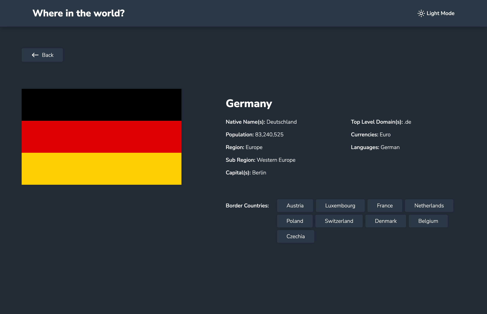
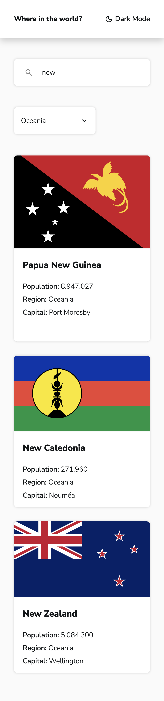
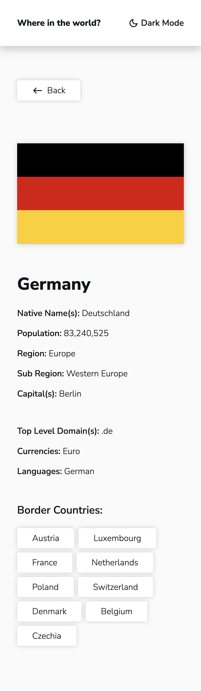
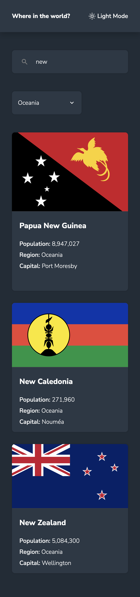
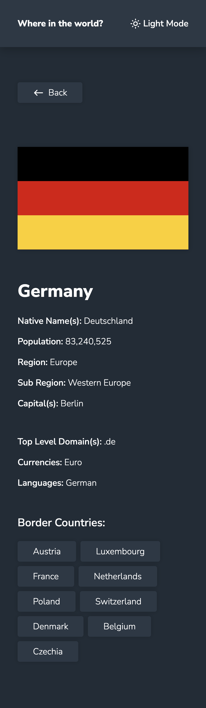

# Results Summary Component

Solution for the [Frontend Mentor](https://frontendmentor.io) challenge - [REST Countries API with color theme switcher](https://www.frontendmentor.io/challenges/rest-countries-api-with-color-theme-switcher-5cacc469fec04111f7b848ca)

## Table of contents

- [The challenge](#the-challenge)
- [API Used](#api-used)
- [Screenshots](#screenshot)
  - [Desktop](#desktop)
  - [Mobile](#mobile)
- [Links](#links)
- [Built with](#built-with)
- [What I learned](#what-i-learned)

## The challenge

Users should be able to:

- See all countries from the API on the homepage
- Search for a country using an `input` field
- Filter countries by region
- Click on a country to see more detailed information on a separate page
- Click through to the border countries on the detail page
- Toggle the color scheme between light and dark mode

## API Used:

Rest Countries - v3.1

- [Documentation](https://restcountries.com/)
- [Repository](https://gitlab.com/restcountries/restcountries/)

## Screenshots

### Desktop






### Mobile






## Links

- [Live Site](/)
- [Solution](/)

## Built with

- [(S)CSS](https://sass-lang.com/)
  - custom properties (variables)
  - modules
  - Flexbox
  - Grid
- Mobile-first approach
- [React](https://react.dev/)
- [Vite](https://vitejs.dev/)

## What I learned

- No typed errors and multiple `catch` blocks in Javascript/Typescript
- Using repeat with `1fr` in a grid doesn't actually size the columns equally.

  - Doesn't work:

  ```css
  .grid-equal-columns {
    grid-template-columns: repeat(5, 1fr);
  }
  ```

  - Works just fine:

  ```css
  .grid-equal-columns {
    grid-template-columns: repeat(5, minmax(0, 1fr));
  }
  ```
